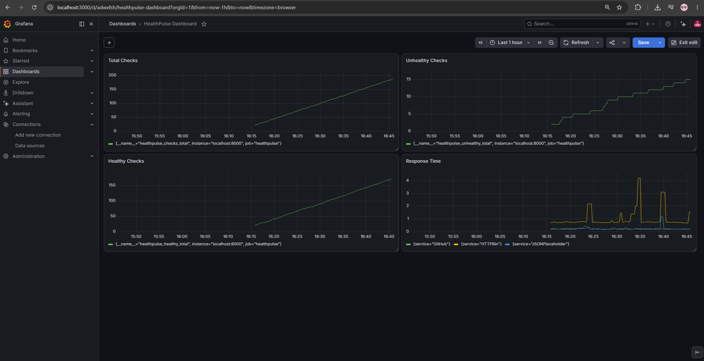
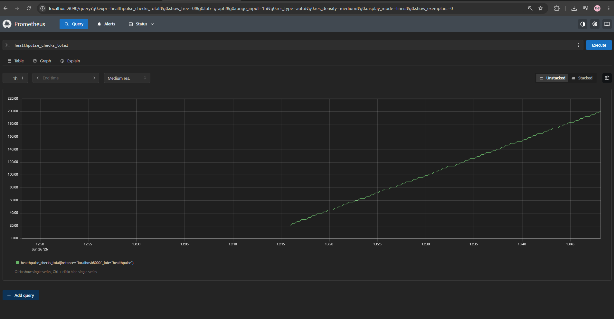

# HealthPulse

A real-time service health monitoring system built in Python — checks live public APIs every 30 seconds, collects metrics, and visualizes everything in a Grafana dashboard powered by Prometheus.

> Built as a learning project to practice Python automation, testing, CI/CD, and the Prometheus + Grafana observability stack.

---

## Grafana Dashboard (Live)



*Four panels running live: Total Checks, Healthy Checks, Unhealthy Checks, and Response Time per service.*

---

## Prometheus (Live)



*The `healthpulse_checks_total` counter growing over time as the app runs — queried directly in the Prometheus UI.*

---

## What This Project Does

HealthPulse continuously pings three real public APIs (GitHub, JSONPlaceholder, HTTPBin), records whether each is up or down, measures response times, and exposes all of that as Prometheus metrics. A Grafana dashboard then visualizes the data in real time.

```
main.py  →  checker.py  →  HTTP request to API
               ↓
           reporter.py  →  formatted console output
               ↓
           metrics.py   →  Prometheus /metrics endpoint  →  Grafana
               ↓
           logger.py    →  daily log file
```

---

## Technologies Used

| Technology | What I Used It For |
|---|---|
| **Python 3.11** | Core language — scripting, automation, HTTP requests |
| **Pytest** | Unit testing with fixtures, mocking, and parametrize |
| **Locust** | Load testing — simulating concurrent users against the API |
| **Prometheus** | Scraping and storing time-series metrics from the app |
| **Grafana** | Building a live dashboard to visualize Prometheus data |
| **GitHub Actions** | CI/CD — running the test suite automatically on every push |
| **Git** | Version control |

---

## Project Structure

```
HealthPulse/
├── .github/
│   └── workflows/
│       └── ci.yml              # GitHub Actions CI pipeline
├── src/
│   ├── checker.py              # HTTP health check logic
│   ├── logger.py               # Dual logging (console + file)
│   ├── reporter.py             # Formatted report generation
│   └── metrics.py              # Prometheus metrics server
├── tests/
│   ├── test_checker.py         # Tests: healthy, timeout, connection error
│   ├── test_logger.py          # Tests: handler count, log level, no duplicates
│   └── test_reporter.py        # Tests: all healthy, all down, mixed scenarios
├── locustfile.py               # Load test configuration
├── main.py                     # Entry point — runs the monitor loop
└── requirements.txt
```

---

## Metrics Collected

| Metric | Type | Description |
|---|---|---|
| `healthpulse_checks_total` | Counter | Total checks performed |
| `healthpulse_healthy_total` | Counter | Total healthy responses |
| `healthpulse_unhealthy_total` | Counter | Total failed checks |
| `healthpulse_response_time_seconds` | Gauge | Response time per service (labeled) |

---

## CI/CD Pipeline

Every push to `main` triggers a GitHub Actions workflow:

```yaml
push → checkout → setup Python 3.11 → pip install → pytest -v
```

The pipeline fails if any test fails, preventing broken code from merging.

---

## How to Run

**Install dependencies**
```bash
pip install -r requirements.txt
```

**Run the health monitor**
```bash
python main.py
```

**Run tests**
```bash
pytest tests/ -v
```

**Run load tests**
```bash
locust -f locustfile.py
```

**Start Prometheus** (point it at `localhost:8000`)
```bash
./prometheus --config.file=prometheus.yml
```

## Running the Full Stack Locally

1. Start the app: `python main.py` — this launches the metrics server on `:8000`
2. Start Prometheus — configure it to scrape `localhost:8000`
3. Open Grafana at `localhost:3000` — add Prometheus as a data source
4. Import or build a dashboard using the metrics above
